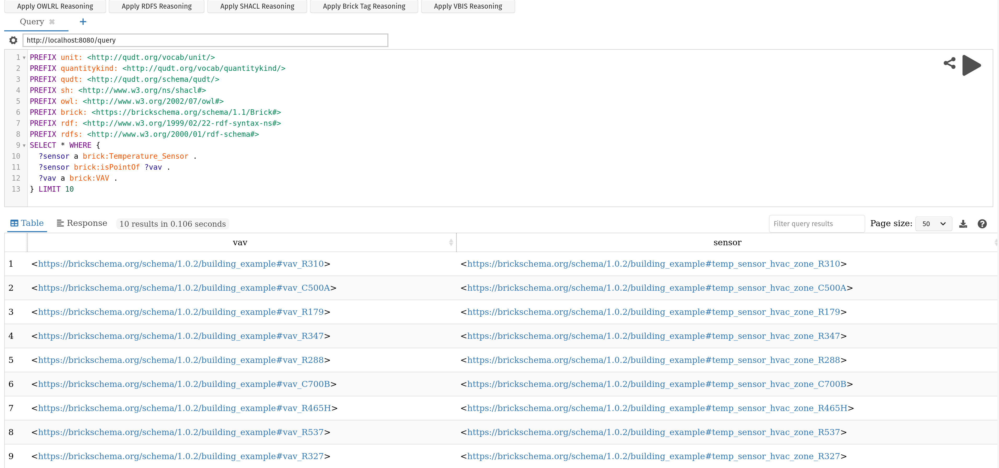

Quick Feature Reference
=======================

Web Interface
-------------

``brickschema`` incorporates a simple web server that makes it easy to apply inference and execute queries on Brick models. Call ``.serve()`` on a Graph object to start the webserver:

.. code-block:: python

  from brickschema import Graph
  g = Graph(load_brick=True)
  # load example Brick model
  g.parse("https://brickschema.org/ttl/soda_brick.ttl")
  g.serve("http://localhost:8080") # optional address argument

Brick Inference
---------------

*Inference* is the process of materializing all of the facts implied about a Brick model given the definitions in the Brick ontology. This process performs, among other things:

* adding in "inverse" edges:
   * Example: for all ``brick:feeds``, add the corresponding ``brick:isFedby``
* annotating instances of classes with their Brick tags:
   * Example: for all instances of ``brick:Air_Temperature_Sensor``, add the mapped tags: ``tag:Air``, ``tag:Temperature``, ``tag:Sensor`` and ``tag:Point``
* annotating instances of classes with their measured substances and quantities:
   * Example: for all instances of ``brick:Air_Temperature_Sensor``, associate the ``brick:Air`` substance and ``brick:Temperature`` quantity
* inferring which classes are implied by the available tags:
   * Example: all entities with the ``tag:Air``, ``tag:Temperature``, ``tag:Sensor`` and ``tag:Point`` tags will be instantiated as members of the ``brick:Air_Temperature_Sensor`` class

The set of rules applied to the Brick model are defined formally here_.

To apply the default inference process to your Brick model, use the ``.expand()`` method on the Graph.

.. code-block:: python

    from brickschema import Graph
    bldg = Graph(load_brick=True)
    bldg.load_file('mybuilding.ttl')
    print(f"Before: {len(bldg)} triples")
    bldg.expand("owlrl")
    print(f"After: {len(bldg)} triples")

.. _here: https://www.w3.org/TR/owl2-profiles/#Reasoning_in_OWL_2_RL_and_RDF_Graphs_using_Rules

Haystack Inference
------------------

Requires a JSON export of a Haystack model
First, export your Haystack model as JSON; we are using the public reference model `carytown.json`.
Then you can use this package as follows:

.. code-block:: python

 import json
 from brickschema import Graph
 model = json.load(open("haystack-export.json"))
 g = Graph(load_brick=True).from_haystack("http://project-haystack.org/carytown#", model)
 points = g.query("""SELECT ?point ?type WHERE {
     ?point rdf:type/rdfs:subClassOf* brick:Point .
     ?point rdf:type ?type
 }""")
 print(points)

SQL ORM (experimental)
-------

.. code-block:: python

    from brickschema.graph import Graph
    from brickschema.namespaces import BRICK
    from brickschema.orm import SQLORM, Location, Equipment, Point
    # loads in default Brick ontology
    g = Graph(load_brick=True)
    # load in our model
    g.load_file("test.ttl")
    # put the ORM in a SQLite database file called "brick_test.db"
    orm = SQLORM(g, connection_string="sqlite:///brick_test.db")
    # get the points for each equipment
    for equip in orm.session.query(Equipment):
        print(f"Equpiment {equip.name} is a {equip.type} with {len(equip.points)} points")
        for point in equip.points:
            print(f"    Point {point.name} has type {point.type}")
    # filter for a given name or type
    hvac_zones = orm.session.query(Location)\
                            .filter(Location.type==BRICK.HVAC_Zone)\
                            .all()
    print(f"Model has {len(hvac_zones)} HVAC Zones")
